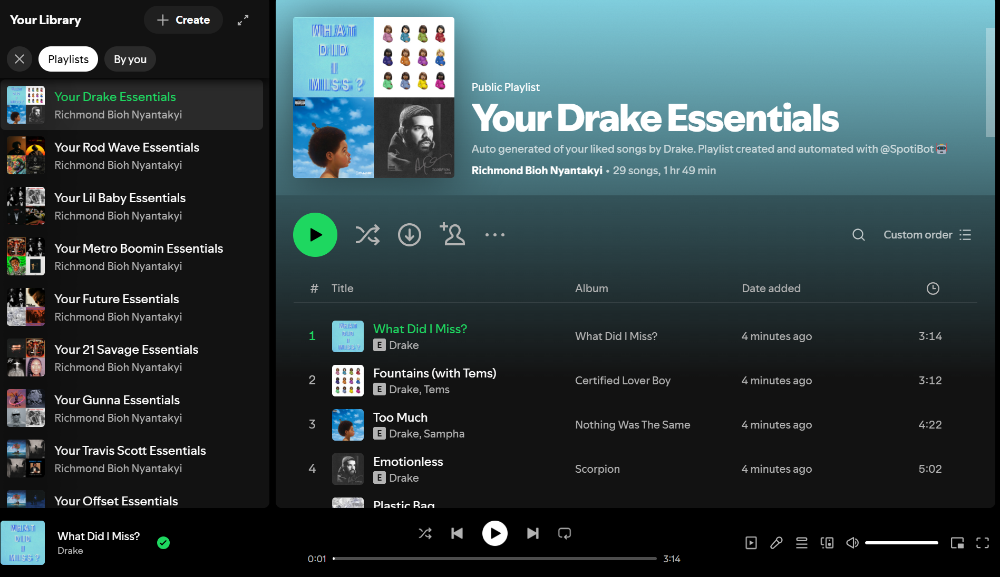

# 🎧 SpotiBot

**SpotiBot** is a personalized Spotify playlist generator that helps users bring order and meaning to their music library — effortlessly.

## 🧠 What It Does

Spotibot analyzes a user’s **liked songs** on Spotify and automatically creates a **dedicated playlist for each artist** found in their collection. Each playlist contains only the tracks by that artist from the user’s liked songs.

This allows users to:
- Quickly find and enjoy all their saved songs from a specific artist
- Avoid manual playlist curation
- Reconnect with forgotten favorites in a more organized way

## 💡 Why It’s Useful

Spotibot solves a common problem: users often "like" hundreds of songs but never get around to organizing them. Over time, this can make it difficult to enjoy specific artists without scrolling endlessly.

Whether you're a casual listener or a music enthusiast, Spotibot creates a cleaner, smarter way to explore your own music taste — one artist at a time.

---

## 🚀 Features

- 🔍 Scan and group liked songs by artist.  
- 🎵 Automatically create personalized artist-specific playlists.  
- ⚡ One-click playlist generation.  
- ‼️SpotiBot generates playlists only for artists that appear in at least 4 times tracks in your liked songs.

---

## 📸 Preview

Here’s an example of a playlist auto-generated by Spotibot:

<p align="center">
    
</p>

---

## 📦 Dependencies

- Python 3.x  
- [Spotify Web API](https://developer.spotify.com/documentation/web-api/)  
- `requests`  
- `Flask Server`  
- `pycopg2-binary`
- `Postgres Database`

---

## 🛠️ Installation

```bash
# Clone the repository
git clone https://github.com/richmond003/SpotiBot.git
cd spotibot

# Install dependencies
pip install -r requirements.txt

# Set up environment variables
# (see .env.example for reference)
